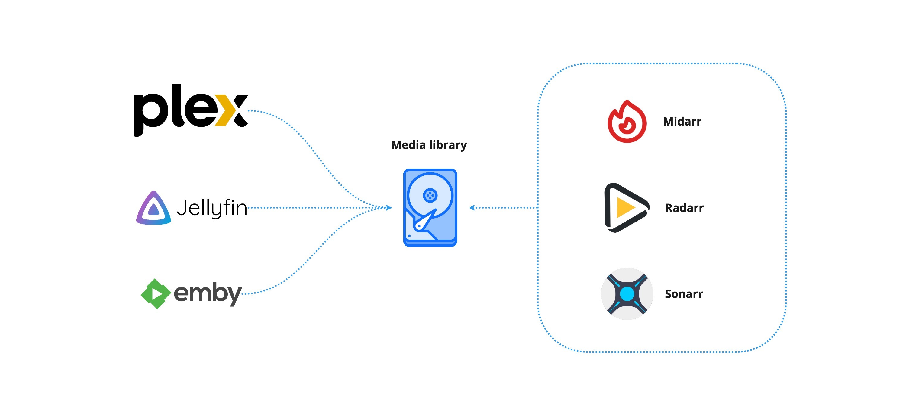

<p align="center">
    
</p>

<p align="center">
    <em>Your media enjoyed through a minimal lightweight media server</em>
</p>

<p align="center">
    <a href="https://github.com/midarrlabs/midarr-server/actions/workflows/master.yml">
        
    </a>
    <a href="https://github.com/midarrlabs/midarr-server/actions/workflows/beta.yml">
        
    </a>
    <a href="https://codecov.io/gh/midarrlabs/midarr-server">
        
    </a>
    <a href="https://github.com/midarrlabs/midarr-server/releases">
        
    </a>
    <a href="https://github.com/midarrlabs/midarr-server/blob/master/LICENSE">
        
    </a>
</p>

Free and open source (and always will be), **Midarr** aims to provide a beautifully tailored experience for **you** and **your**
users:

* Beautifully crafted user interface
* Real-time online statuses
* Simple and easy invite system
* Integrates with your existing services, [Radarr](https://radarr.video/) and [Sonarr](https://sonarr.tv/)


### What is this?

In its' current form, this is a lightweight (albeit companion) media server to the likes of Radarr and Sonarr. 
Your media is left untouched and unscathed as it is served through a simple (yet familiar) web interface that puts your media front and center for
**your** users to enjoy.

While other media solutions look to re-index, re-fetch and re-double handle your media library, **Midarr** simply levarages your already existing
services to delight and enchant **your** users' media experience.



### How is this lightweight?

* **No media indexing.** All the metadata needed is already on your server. **Midarr** never goes out looking for more, everything we need you already have.
* **No media transcoding.** Nope, none whatsoever. Your media is served fresh off the metal.
* **No media editing.** We trust you already have it the way you like it, lets keep it that way.

### What does this do?

Your media is served through a slick web interface providing:

* User authentication
* User profile settings
* User online statuses

with more features planned ahead.

## Usage

### Docker compose

```yaml
services:
  
  midarr:
    container_name: midarr
    image: ghcr.io/midarrlabs/midarr-server:latest
    ports:
      - 4000:4000
    volumes:
#       Database path
      - /path/to/database:/app/database

#       Media path
      - /path/to/movies:/radarr/movies/path
      - /path/to/shows:/sonarr/shows/path

    environment:
#       App config
      - APP_URL=http://localhost:4000
      - APP_MAILER_FROM=example@email.com
      - SENDGRID_API_KEY=someApiKey

#       Initialise admin account
      - SETUP_ADMIN_EMAIL=admin@email.com
      - SETUP_ADMIN_NAME=admin
      - SETUP_ADMIN_PASSWORD=passwordpassword # minimum length 12

#       Radarr integration
      - RADARR_BASE_URL=radarr:7878
      - RADARR_API_KEY=someApiKey

#       Sonarr integration
      - SONARR_BASE_URL=sonarr:8989
      - SONARR_API_KEY=someApiKey
```

## Setup

### Integrations

* Supports Radarr - `v4.1`
* Supports Sonarr - `v3.0`

On server startup **Midarr** attempts to auto configure your integrations by:

* **Caching movie and series responses.** This is for speedy access to your library
* **Adding webhook / connect endpoints.** This is for keeping your cache in sync

> __Warning__
>
> Ensure your integration environment variables are set for auto configuration to complete

```yaml
environment:
  - RADARR_BASE_URL=radarr:7878
  - RADARR_API_KEY=someApiKey

  - SONARR_BASE_URL=sonarr:8989
  - SONARR_API_KEY=someApiKey
```


### Media library

For your media locations to resolve, please provide the following **paths** as found in your integrations.

```yaml
volumes:
  - /path/to/movies:/radarr/movies/path
  - /path/to/shows:/sonarr/shows/path
```

### Admin account

To initialise this, please provide the following **environment variables**. This will allow you to configure your server at the **settings** page.

```yaml
environment:
  - SETUP_ADMIN_EMAIL=admin@email.com
  - SETUP_ADMIN_NAME=admin
  - SETUP_ADMIN_PASSWORD=passwordpassword # minimum length 12
```

## Support

### Videos

* H.264 / H.265 codec
* AAC / MP3 audio
* MP4 / MKV container

### Subtitles

A single **.srt** file in the root directory of the video is currently supported. With this setup a subtitle / caption option will be available in the player view.

```
library/video
          └──video.srt
          └──video.mp4
```

## Contributing

Thank you for all your contributions! Big or small - all is welcome!

### Local development

1. Fork and git clone the repository

```
git clone https://github.com/{ YOUR-ACCOUNT }/midarr-server.git
```

2. Docker compose up the stack

```
cd midarr-server && docker compose up -d
```
3. Service locations:

- [http://localhost:4000](http://localhost:4000) - Midarr
- [http://localhost:7878](http://localhost:7878) - Radarr
- [http://localhost:8989](http://localhost:8989) - Sonarr

## License

**Midarr** is open-sourced software licensed under the [MIT license](LICENSE).

## Preview


