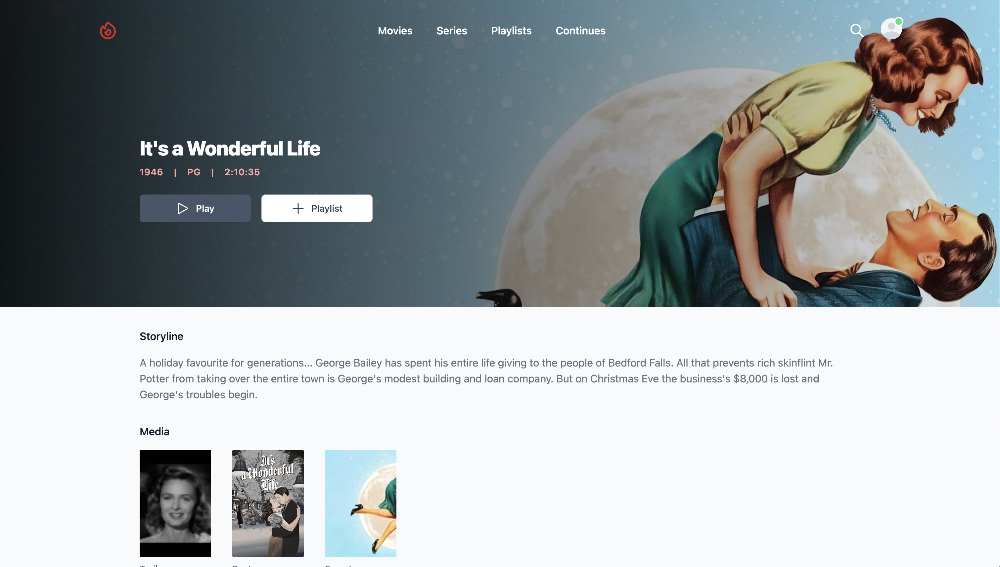

<p align="center">
    
</p>

<p align="center">
    <a href="https://github.com/midarrlabs/midarr-server/actions/workflows/master.yml">
        
    </a>
    <a href="https://codecov.io/gh/midarrlabs/midarr-server">
        
    </a>
    <a href="https://github.com/midarrlabs/midarr-server/releases">
        
    </a>
    <a href="https://github.com/midarrlabs/midarr-server/blob/master/LICENSE">
        
    </a>
</p>

***Midarr*** is a minimal lightweight media server for enjoying your media:

* Free and open source
* Beautifully crafted user interface
* Real-time online statuses
* Simple and easy invite system
* Integrates with your existing services, [Radarr](https://radarr.video/) and [Sonarr](https://sonarr.tv/)

with much more to come...


### What is this?

In its' current form, this a lightweight (albeit companion) media server to the likes of Radarr and Sonarr. It integrates with these services to serve your **H.264** / **H.265** codec video untouched and unscathed.

> While more fully fledged media server options already exist, ***Midarr*** simply compliments as a lightweight alternative.

### How is it lightweight?

* No media indexing
* No media transcoding
* No media editing

### What does it do?

Your media is served through a slick web interface providing:

* User authentication
* User profile settings
* User online statuses

with more features planned ahead.

## Usage

Docker compose example:

```yaml
services:
  
  midarr:
    container_name: midarr
    image: ghcr.io/midarrlabs/midarr-server:latest
    ports:
      - 4000:4000
    volumes:
#       Database path
      - /path/to/database:/app/database

#       Media path
      - /path/to/movies:/radarr/movies/path
      - /path/to/shows:/sonarr/shows/path

    environment:
#       App config
      - APP_URL=http://localhost:4000
      - APP_MAILER_FROM=example@email.com
      - SENDGRID_API_KEY=someApiKey

#       Initialise admin account
      - SETUP_ADMIN_EMAIL=admin@email.com
      - SETUP_ADMIN_NAME=admin
      - SETUP_ADMIN_PASSWORD=passwordpassword # minimum length 12

#       Radarr integration
      - RADARR_BASE_URL=radarr:7878
      - RADARR_API_KEY=someApiKey

#       Sonarr integration
      - SONARR_BASE_URL=sonarr:8989
      - SONARR_API_KEY=someApiKey
```

## Configuration

### Media library

This must be mounted as in your Radarr and Sonarr instances:

```yaml
volumes:
  - /path/to/movies:/radarr/movies/path
  - /path/to/shows:/sonarr/shows/path
```
This is so ***Midarr*** has the same reference to your media library as your integrations, and can resolve their locations.

### Initialise admin account

An admin account will be initialised for you on server startup, provided you have these `environment` variables configured:

```yaml
environment:
  - SETUP_ADMIN_EMAIL=admin@email.com
  - SETUP_ADMIN_NAME=admin
  - SETUP_ADMIN_PASSWORD=passwordpassword # minimum length 12
```
Login with these credentials, and access the `Settings` page to configure your server.

## Support

### Integrations

* Radarr - `v4.1.0`
* Sonarr - `v3.0.9`

> Your integrations are auto configured through best effort attempts

On server startup ***Midarr*** attempts a few things:

* Caches movie and series responses - this is to speed up the initial querying of your library
* Adds webhook / connect endpoints - this is used to update the cache

### Videos

The following video format is currently supported:

* H.264 / H.265 codec
* AAC / MP3 audio
* MP4 / MKV container

### Subtitles

A single `*.srt` file in the root directory of the video is currently supported:

```
library/video
          └──video.srt
          └──video.mp4
```
With this setup a subtitle / caption option will be available in the player view.

## Contributing

Thank you for all your contributions! Big or small - all is welcome!

### Local development

1. Fork and git clone the repository

```
git clone https://github.com/{ YOUR-ACCOUNT }/midarr-server.git
```

2. Docker compose up the stack

```
cd midarr-server && docker compose up -d
```
3. Service locations:

- [http://localhost:4000](http://localhost:4000) - Midarr
- [http://localhost:7878](http://localhost:7878) - Radarr
- [http://localhost:8989](http://localhost:8989) - Sonarr

## License

***Midarr*** is open-sourced software licensed under the [MIT license](LICENSE).

## Preview




